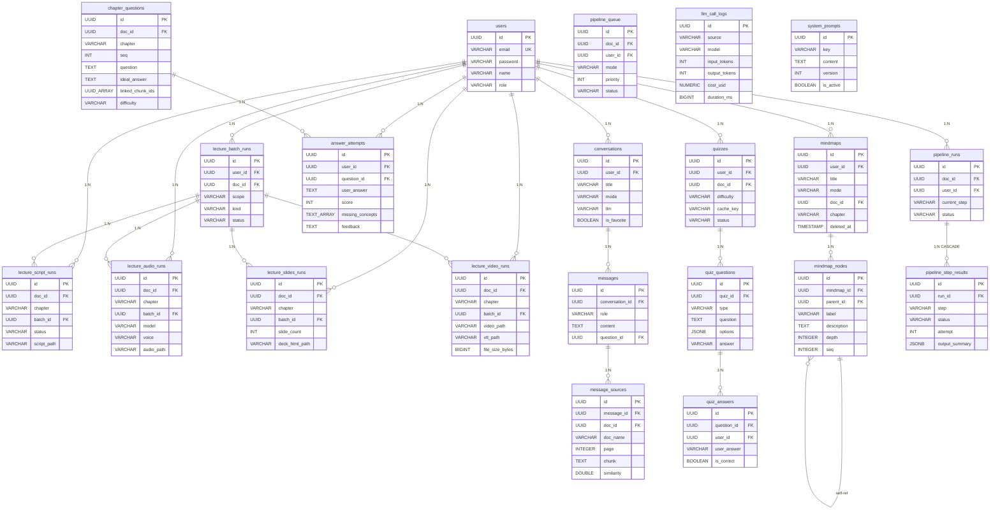

# DevLearn

AI 기반 능동 학습 플랫폼. PDF 문서를 업로드하면 파인만 학습법으로 개념을 검증하고, 퀴즈를 자동 생성하며, 마인드맵으로 지식을 구조화하고, AI 강의 영상까지 자동 생성할 수 있다.

---

## 목차

- [개요](#개요)
- [멤버 구성](#멤버-구성)
- [프로젝트 목적](#프로젝트-목적)
- [ERD](#erd)
- [구현 기능](#구현-기능)
- [프로젝트 회고](#프로젝트-회고)
- [Reference](#reference)
- [구현 화면](#구현-화면)

---

## 개요

| 항목 | 내용 |
|------|------|
| 프로젝트 이름 | DevLearn (데브런) |
| 프로젝트 기간 | 2026.04.20 ~ 진행 중 |
| Back-End | Java 21, Spring Boot 4.0.5, MyBatis 3, PostgreSQL 17, pgvector, Gradle 9.4.1 |
| Front-End | React, JavaScript, Vite, TailwindCSS |
| LLM | OpenAI (gpt-5.4-mini), Claude (3.5 Sonnet), Ollama (로컬 모델) |
| 개발 TOOL | IntelliJ IDEA, VS Code |
| 협업 TOOL | Git, GitHub, Claude Code (AI 페어 프로그래밍) |
| 외부 API | OpenAI API, Anthropic API, OpenAI TTS API |

---

## 멤버 구성

| 역할 | 이름 | 담당 |
|------|------|------|
| 1인 개발 | 문희석 | 기획, 설계, 프론트엔드, 백엔드, DB 전체 |

---

## 프로젝트 목적

다른 주제로 프로젝트를 할 수 있었으나, 평소 학습할 때 느꼈던 불편함을 직접 해결하고 싶었습니다.

PDF 교재를 읽고 넘기는 **수동 학습**이 아닌, AI와 대화하며 이해도를 검증하는 **능동 학습**을 구현하는 것이 목적이었습니다.

1. **파인만 학습법의 디지털 구현** — PDF를 업로드하면 AI가 핵심 질문을 생성하고, 사용자의 설명을 RAG 기반으로 채점하여 이해 수준을 평가한다.
2. **멀티 LLM 채팅** — OpenAI, Claude, Ollama 등 다양한 모델을 하나의 인터페이스에서 전환하며 사용할 수 있다.
3. **마인드맵 지식 구조화** — 수동 생성 또는 PDF 챕터 기반 자동 생성으로 학습 내용을 시각적으로 정리한다.
4. **AI 강의 영상 자동 생성** — 대본 생성 → TTS 오디오 → 슬라이드 → 영상 합성까지 4단계 파이프라인으로 강의 영상을 만든다.

---

## ERD

21개 테이블, 13개 컨트롤러, 84개 API 엔드포인트

---

## 구현 기능

### 1. AI 채팅

- **멀티 LLM 지원**: OpenAI(gpt-5.4-mini), Claude(3.5 Sonnet), Ollama(로컬 모델)
- **SSE 스트리밍**: 토큰 단위 실시간 응답
- **대화 관리**: 생성 / 수정 / 즐겨찾기 / 일괄 삭제
- **컨텍스트 유지**: 대화 히스토리를 LLM에 전달

### 2. 파인만 학습 모드

- **PDF 업로드 & 파이프라인**: 텍스트 추출 → 목차 인식 → 챕터 분류 → 벡터 임베딩
- **챕터별 질문 자동 생성**: 2-pass 방식으로 핵심 개념 질문 ~10개 생성
- **마인드맵 기반 면접형 학습**: 마인드맵 노드를 grounding으로 활용한 대화형 학습
- **RAG 기반 답변 채점**: pgvector 코사인 유사도 검색으로 원문 근거 확보 후 채점
- **누락 개념 추적**: 사용자 답변에서 빠진 핵심 개념을 식별하여 피드백
- **출처 패널**: RAG 청크 + 마인드맵 노드를 sourceType별로 출처 표시

### 3. 마인드맵

- **수동 생성**: 노드 추가/삭제/이동, 색상 지정, 트리 구조 관리
- **PDF 챕터 기반 자동 생성**: 파이프라인 완료 문서에서 챕터 선택 → AI가 마인드맵 구조 합성
- **키워드 기반 구조**: 노드에 label/description/depth/seq 포함
- **소프트 삭제 & 복구**: 삭제 시 soft delete, 라이브러리 뷰에서 복구 가능

### 4. AI 강의 영상 생성

- **Phase 1 — 대본 생성**: 챕터 내용 기반 LLM 강의 대본 생성
- **Phase 2 — TTS 오디오**: OpenAI TTS API로 음성 합성
- **Phase 3 — 슬라이드**: LLM으로 HTML 슬라이드 생성 후 이미지 캡처
- **Phase 4 — 영상 합성**: FFmpeg로 오디오 + 슬라이드 합성, 자막(VTT) 자동 생성
- **일괄 생성**: 책/과목 단위 일괄 처리 (batch)

### 5. 파이프라인 모니터링

- 문서 처리 파이프라인 실행 이력 조회
- 단계별 성공/실패 상태, 소요 시간, 사용 모델 추적
- LLM 호출 로그 (토큰 수, 비용, 소요 시간) 실시간 모니터링
- 실패 시 재실행 기능

### 6. 공통 기능

| 기능 | 설명 |
|------|------|
| Rate Limiting | 일반 API 60req/min, LLM API 10req/min (Bucket4j) |
| XSS 필터 | 요청 파라미터/헤더 HTML 이스케이프 |
| CORS | 프론트엔드 개발 서버 허용 |
| 통합 에러 처리 | GlobalExceptionHandler + ErrorCode enum |
| Swagger UI | API 문서 자동 생성 (springdoc-openapi) |
| 비동기 처리 | 커스텀 스레드 풀 (코어 5 / 최대 10 / 큐 25) |
| 소유권 검증 | 모든 데이터 접근 시 userId 기반 권한 확인 |
| 시스템 프롬프트 DB 관리 | 코드 하드코딩 없이 DB에서 프롬프트 버전 관리 |
| LLM 사용량 추적 | 모든 LLM 호출의 토큰/비용/소요시간 기록 |

---

## 프로젝트 회고

<!-- 프로젝트 완료 후 작성 예정 -->

---

## Reference

| 기술 | 문서 |
|------|------|
| Spring Boot | https://spring.io/projects/spring-boot |
| MyBatis | https://mybatis.org/mybatis-3/ |
| PostgreSQL | https://www.postgresql.org/docs/17/ |
| pgvector | https://github.com/pgvector/pgvector |
| JWT (jjwt) | https://github.com/jwtk/jjwt |
| Apache PDFBox | https://pdfbox.apache.org/ |
| Bucket4j | https://github.com/bucket4j/bucket4j |
| springdoc-openapi | https://springdoc.org/ |
| OpenAI API | https://platform.openai.com/docs |
| Anthropic API | https://docs.anthropic.com/ |

---

## 구현 화면

<!-- 추후 스크린샷 추가 예정 -->
