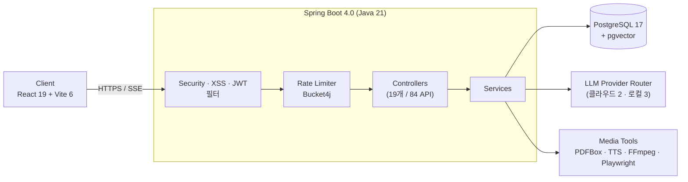
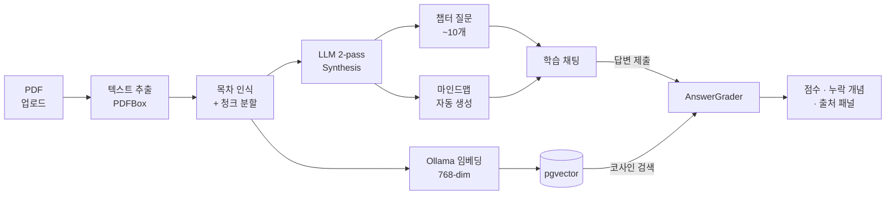
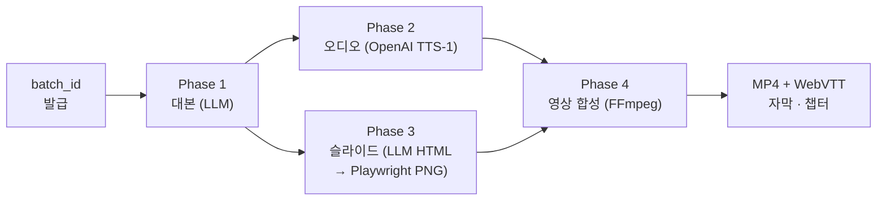

# DevLearn

**서비스 도메인:** [https://devlearnrag.com](https://devlearnrag.com)  
**사용 클라우드:** 네이버클라우드  
**도메인:** 가비아

AI 기반 능동 학습 플랫폼. PDF 문서를 업로드하면 파인만 학습법으로 개념 이해도를 검증하고, 마인드맵으로 지식을 구조화하며, 챕터 단위 AI 강의 영상까지 자동 생성할 수 있다. 일반 / 공부 / 업무학습 3-모드 채팅을 클라우드·로컬 LLM 5종에서 자유롭게 전환해 사용한다.

---

## 목차

- [개요](#개요)
- [멤버 구성](#멤버-구성)
- [프로젝트 목적](#프로젝트-목적)
- [ERD](#erd)
- [구현 기능](#구현-기능)
- [시스템 아키텍처](#시스템-아키텍처)
- [구현 화면](#구현-화면)

---

## 개요

| <nobr>&nbsp;&nbsp;&nbsp;&nbsp;&nbsp;&nbsp;&nbsp;항목&nbsp;&nbsp;&nbsp;&nbsp;&nbsp;&nbsp;&nbsp;</nobr> | 내용 |
|------|------|
| <nobr>프로젝트 이름</nobr> | DevLearn (데브런) |
| <nobr>프로젝트 기간</nobr> | 2026.04.20 ~ 진행 중 (달력 기준) |
| <nobr>실 투입 공수</nobr> | **11 공수** (2026.05.13 기준) |
| <nobr>Back-End</nobr> | Java 21, Spring Boot 4.0.5, MyBatis 3, PostgreSQL 17, pgvector, Gradle 9.4.1 |
| <nobr>Front-End</nobr> | React 19, Vite 6, Zustand 5, Tailwind CSS 3, React Router 6, ReactFlow 11, framer-motion, recharts, react-markdown, html-to-image + jsPDF |
| <nobr>LLM (클라우드)</nobr> | OpenAI GPT-5.4 mini, Claude Sonnet 4.6 |
| <nobr>LLM (로컬)</nobr> | Llama 3.1 8B, EXAONE 3.5 32B, GPT-OSS 20B (Ollama 서버) |
| <nobr>개발 TOOL</nobr> | IntelliJ IDEA, VS Code |
| <nobr>협업 TOOL</nobr> | Git, GitHub, Claude Code (AI 페어 프로그래밍) |
| <nobr>외부 API</nobr> | OpenAI API, Anthropic API, OpenAI TTS API |

---

## 멤버 구성

| 역할 | 이름 |
|------|------|
| 1인 개발 (기획·설계·FE·BE·DB) | 문희석 |

---

## 프로젝트 목적

다른 주제로 프로젝트를 할 수 있었으나, 평소 학습할 때 느꼈던 불편함을 직접 해결하고 싶었습니다.

PDF 교재를 읽고 넘기는 **수동 학습**이 아닌, AI와 대화하며 이해도를 검증하는 **능동 학습**을 구현하는 것이 목적이었습니다.

1. **파인만 학습법의 디지털 구현** — PDF를 업로드하면 AI가 핵심 질문을 생성하고, 사용자의 설명을 RAG 기반으로 채점하여 이해 수준을 평가한다.
2. **멀티 LLM 채팅** — OpenAI, Claude, Ollama 등 다양한 모델을 하나의 인터페이스에서 전환하며 사용할 수 있다.
3. **마인드맵 지식 구조화** — 수동 생성 또는 PDF 챕터 기반 자동 생성으로 학습 내용을 시각적으로 정리한다.
4. **AI 강의 영상 자동 생성** — 대본 생성 → TTS 오디오 → 슬라이드 → 영상 합성까지 4단계 파이프라인으로 강의 영상을 만든다.

---

## ERD

**25개 테이블, 19개 컨트롤러, 84개 API 엔드포인트** (2026-05-13 기준)

테이블은 6개 도메인으로 묶인다: 인증 · 채팅 · RAG/문서 · 학습/마인드맵 · 강의 영상 · 운영.

```mermaid
erDiagram
    users ||--o{ conversations : "1:N"
    users ||--o{ rag_docs : "1:N"
    users ||--o{ mindmaps : "1:N"
    users ||--o{ quizzes : "1:N"
    users ||--o{ answer_attempts : "1:N"
    users ||--o{ pipeline_runs : "1:N"
    users ||--o{ lecture_batch_runs : "1:N"
    users ||--o{ suggestions : "1:N"

    conversations ||--o{ messages : "1:N"
    messages ||--o{ message_sources : "1:N"

    rag_docs ||--o{ rag_chunks : "1:N"
    rag_docs ||--o{ chapter_questions : "1:N"
    rag_docs ||--o{ mindmaps : "0..1:N (자동 생성)"
    rag_docs ||--o{ pipeline_runs : "1:N"
    rag_docs ||--o{ quizzes : "1:N"
    rag_docs ||--o{ lecture_batch_runs : "1:N"

    chapter_questions ||--o{ answer_attempts : "1:N"

    quizzes ||--o{ quiz_questions : "1:N"
    quiz_questions ||--o{ quiz_answers : "1:N"

    mindmaps ||--o{ mindmap_nodes : "1:N"
    mindmap_nodes ||--o{ mindmap_nodes : "self-ref (parent)"

    pipeline_runs ||--o{ pipeline_step_results : "1:N CASCADE"

    lecture_batch_runs ||--o{ lecture_script_runs : "1:N"
    lecture_batch_runs ||--o{ lecture_audio_runs : "1:N"
    lecture_batch_runs ||--o{ lecture_slides_runs : "1:N"
    lecture_batch_runs ||--o{ lecture_video_runs : "1:N"

    users {
        UUID id PK
        VARCHAR email UK
        VARCHAR password
        VARCHAR name
        VARCHAR role "USER / ADMIN"
    }

    conversations {
        UUID id PK
        UUID user_id FK
        VARCHAR title
        VARCHAR mode "general/study/worklearn"
        VARCHAR llm
        BOOLEAN is_favorite
    }

    messages {
        UUID id PK
        UUID conversation_id FK
        VARCHAR role
        TEXT content
        UUID question_id FK
    }

    message_sources {
        UUID id PK
        UUID message_id FK
        UUID doc_id FK
        VARCHAR doc_name
        INTEGER page
        TEXT chunk
        DOUBLE similarity
    }

    rag_docs {
        UUID id PK
        UUID user_id FK
        VARCHAR file_name
        VARCHAR file_path
        INTEGER pages
        INTEGER chunks
        VARCHAR status
        INTEGER progress
        BOOLEAN rag_indexed
        TIMESTAMP deleted_at
    }

    rag_chunks {
        UUID id PK
        UUID doc_id FK
        TEXT content
        INTEGER page
        VARCHAR chapter
        INTEGER seq
        vector embedding "768-dim"
    }

    chapter_questions {
        UUID id PK
        UUID doc_id FK
        VARCHAR chapter
        INT seq
        TEXT question
        TEXT ideal_answer
        UUID_ARRAY linked_chunk_ids
        VARCHAR difficulty
    }

    answer_attempts {
        UUID id PK
        UUID user_id FK
        UUID question_id FK
        TEXT user_answer
        INT score
        TEXT_ARRAY missing_concepts
        TEXT feedback
    }

    quizzes {
        UUID id PK
        UUID user_id FK
        UUID doc_id FK
        VARCHAR difficulty
        VARCHAR cache_key
        VARCHAR status
    }

    quiz_questions {
        UUID id PK
        UUID quiz_id FK
        VARCHAR type
        TEXT question
        JSONB options
        VARCHAR answer
    }

    quiz_answers {
        UUID id PK
        UUID question_id FK
        UUID user_id FK
        VARCHAR user_answer
        BOOLEAN is_correct
    }

    mindmaps {
        UUID id PK
        UUID user_id FK
        VARCHAR title
        VARCHAR mode
        UUID doc_id FK "자동 생성 시"
        VARCHAR chapter
        TIMESTAMP deleted_at "soft delete"
    }

    mindmap_nodes {
        UUID id PK
        UUID mindmap_id FK
        UUID parent_id FK
        VARCHAR label
        TEXT description
        INTEGER depth
        INTEGER seq
    }

    pipeline_runs {
        UUID id PK
        UUID doc_id FK
        UUID user_id FK
        VARCHAR current_step
        VARCHAR status
    }

    pipeline_step_results {
        UUID id PK
        UUID run_id FK
        VARCHAR step
        VARCHAR status
        INT attempt
        JSONB output_summary
    }

    pipeline_queue {
        UUID id PK
        UUID doc_id FK
        UUID user_id FK
        VARCHAR mode
        INT priority
        VARCHAR status
    }

    lecture_batch_runs {
        UUID id PK
        UUID user_id FK
        UUID doc_id FK
        VARCHAR scope
        VARCHAR kind "script/audio/slides/video"
        VARCHAR status
    }

    lecture_script_runs {
        UUID id PK
        UUID doc_id FK
        VARCHAR chapter
        UUID batch_id FK
        VARCHAR status
        VARCHAR script_path
    }

    lecture_audio_runs {
        UUID id PK
        UUID doc_id FK
        VARCHAR chapter
        UUID batch_id FK
        VARCHAR model
        VARCHAR voice
        VARCHAR audio_path
    }

    lecture_slides_runs {
        UUID id PK
        UUID doc_id FK
        VARCHAR chapter
        UUID batch_id FK
        INT slide_count
        VARCHAR deck_html_path
    }

    lecture_video_runs {
        UUID id PK
        UUID doc_id FK
        VARCHAR chapter
        UUID batch_id FK
        VARCHAR video_path
        VARCHAR vtt_path
        BIGINT file_size_bytes
    }

    llm_call_logs {
        UUID id PK
        VARCHAR source
        VARCHAR model
        INT input_tokens
        INT output_tokens
        NUMERIC cost_usd
        BIGINT duration_ms
    }

    system_prompts {
        UUID id PK
        VARCHAR key
        TEXT content
        INT version
        BOOLEAN is_active
    }

    suggestions {
        UUID id PK
        UUID user_id FK
        VARCHAR title
        VARCHAR content
        VARCHAR categories "CSV"
        TIMESTAMP created_at
    }

    site_visits {
        UUID id PK
        TIMESTAMP visited_at
        VARCHAR ip_hash
        VARCHAR user_agent
    }
```

> `llm_call_logs` · `system_prompts` · `site_visits` 는 사용자 데이터와 직접 FK가 없는 운영 테이블이라 관계선 없이 정의만 표기.

---

## 구현 기능

### 1. 3-모드 채팅 인터페이스

`src/registry/modes.js`에 선언적으로 정의된 3가지 모드. 사이드바 탭 한 번으로 전환되며, 모드별 대화 슬롯·마인드맵 컨텍스트가 독립적으로 유지된다.

| 모드 | 화면 구성 | 용도 |
|------|----------|------|
| **일반** | 단일 채팅 패널 | 자유 질의응답 (모드 전용 LLM 선택) |
| **공부** | 좌·우 분할 워크스페이스 (드래그 리사이저) | 좌측: 일반 학습 채팅 / 우측: PDF 챕터 기반 파인만 점검 |
| **업무학습** | 좌·우 분할 워크스페이스 | 좌측: 업무 질의응답 / 우측: 업무 자료 챕터 단위 검증 |

- **멀티 LLM 지원**: 클라우드 2종(GPT-5.4 mini · Claude Sonnet 4.6), 로컬 3종(Llama 3.1 8B · EXAONE 3.5 32B · GPT-OSS 20B). 클라우드 전용 배포 환경에서는 로컬 모델이 자동 비활성화된다.
- **SSE 스트리밍**: 토큰 단위 실시간 응답 — `useStreamingChat` 훅이 3개 모드 공통.
- **대화 관리**: 생성 / 이름변경 / 즐겨찾기 / 일괄 삭제 / 모델별 새 채팅 자동 오픈 (LLM 드롭다운에서 모델 변경 시 즉시 새 대화 시작).
- **음성 입력(STT)**: 채팅 입력창의 마이크 버튼으로 Web Speech API 기반 음성 → 텍스트 변환.
- **마크다운**: GFM, 코드 블록, 출처(footnote) 카드 렌더링.

### 2. 파인만 학습 파이프라인

- **PDF 업로드**: 드래그앤드롭 다중 업로드, role 기반 크기 한도(USER 50MB / ADMIN 1GB), 사이드바 `DocumentUploadModal` + 파인만 파이프라인 관리 탭 양쪽에서 진입.
- **파이프라인 4단계**: 텍스트 추출(PDFBox) → 목차 인식 → 챕터 분류 → 벡터 임베딩(Ollama 768-dim, pgvector 저장).
- **챕터별 질문 자동 생성**: 2-pass LLM으로 핵심 개념 질문 ~10개 + ideal_answer 생성.
- **마인드맵 grounding 채팅**: 우측 패널이 자동 생성된 마인드맵 노드를 컨텍스트로 채팅 진행.
- **RAG 기반 답변 채점**: pgvector 코사인 유사도 검색으로 원문 근거 확보 → `AnswerGraderService` 점수 + 누락 개념 식별.
- **출처 패널**: RAG 청크 + 마인드맵 노드를 sourceType별로 분리 표시, 원문 페이지·유사도 동봉.

### 3. 마인드맵

`useMindmapStore`가 모드별로 독립 관리 (`maps{}` + `activeMapId` + `lastActiveByMode`). 전체 모드에서 마인드맵 토글로 50:50 분할 뷰 활성화.

- **수동 생성**: ReactFlow 캔버스에서 노드 추가 / 더블클릭 인라인 편집 / 드래그 이동 / 우클릭 색상·삭제 / dagre 자동 레이아웃.
- **PDF 챕터 기반 자동 생성**: 파이프라인 완료 문서에서 챕터 선택 → AI가 label/description/depth/seq 구조 합성.
- **자동 생성 라이브러리**: 파이프라인 완료된 모든 챕터 마인드맵을 페이지네이션(10개/페이지) 뷰로 노출. [보기] 클릭 시 soft-delete된 항목도 자동 복원.
- **Soft delete & 복구**: 단건 + 체크박스 다중 선택 일괄 삭제, 빈 nodes 업데이트 차단 가드(데이터 손실 방지).
- **PDF 내보내기**: html-to-image + jsPDF로 캔버스 캡처.
- **자동저장 표시**: "N초 전 저장됨" 실시간 갱신.

### 4. AI 강의 영상 생성

마인드맵 기반 강의 파이프라인. 챕터 단위 `batch_id` 발급 후 4단계 독립 실행 — 실패 지점부터 재실행 가능.

| Phase | 산출물 | 도구 |
|-------|--------|------|
| 1 — 대본 | 챕터 강의 markdown | LLM |
| 2 — 오디오 | 슬라이드별 MP3 | OpenAI TTS-1 |
| 3 — 슬라이드 | 1920×1080 PNG 시퀀스 | LLM이 HTML 생성 → Playwright 캡처 |
| 4 — 영상 | MP4 + WebVTT 자막/챕터 | FFmpeg (오디오 길이 기반 슬라이드 duration) |

- 챕터 단위 / 책 전체 단위 일괄(batch) 실행 지원.
- 각 단계는 `lecture_*_runs` 테이블에 독립 기록.

### 5. 모니터링·관리자 도구

- **관리자 대시보드** (`/admin`, ADMIN role 가드): 통계 카드(대화·문서·마인드맵·답변 수) / 최근 대화 / RAG 문서 현황 / **사용자 채팅 모니터링 보드** / **LLM 사용량 대시보드**(토큰·비용·소요시간) / **기능개선 제안 게시판**. 서버 집계 실패 시 로컬 스토어 폴백.
- **로컬 LLM 활동 모니터** (`/llm-activity`): 백엔드 라이브 로그 실시간 캡처. 우하단 플로팅 버튼으로 어느 화면에서든 드로어 열기.
- **파이프라인 관리 탭**: 문서 처리 실행 이력 + 단계별 상태 + 실패 재실행. 페이지네이션 + 상태 필터.

### 6. 사용자·접근성

- **회원가입 / 로그인**: 이메일·비밀번호 기반. JWT (Access + Refresh).
- **누적 방문자 카운터**: 사이드바 하단 표시. 세션당 1회 hit + 서버측 IP 24h 가드 + 봇 필터.
- **사용량 바**: 일일/월간 LLM 호출량 시각화 (모드별 한도 근접 시 경고).
- **화면 선명도 보호필름**: 사이드바 슬라이더로 전화면 블러. 최저값 도달 시 비밀번호 게이트 → 해제 시 100% 자동 복원.
- **기능개선 제안 모달**: 카테고리(ui/feature/bug/performance/etc) 선택 + 본문. 관리자 게시판으로 직결.

### 7. 공통 UX

- **다크 모드 디자인 토큰**: CSS 변수(`globals.css`) → Tailwind 유틸리티 (`bg-bg-primary` 등). 색상 하드코딩 없음.
- **브라우저 alert/confirm 미사용**: 위험 동작은 인-앱 팝오버 + Toast.
- **모바일 사이드바 드로어** (768px 미만 오버레이 전환).
- **코드 스플리팅**: `React.lazy` + `Suspense` (모드/관리자 페이지/LLM 모니터 별 청크).
- **상태 영속성**: Zustand persist → localStorage (auth, 대화, 마인드맵, study).
- **에러 처리**: 중앙 `errorHandler` (NETWORK/TIMEOUT/SERVER 분류) + Toast + `/error/:code` 페이지 라우팅.
- **한국어 IME**: `e.nativeEvent.isComposing` 일관 처리.

### 8. 백엔드 공통 기능

| 기능 | 설명 |
|------|------|
| Rate Limiting | 일반 API 60req/min, LLM API 10req/min (Bucket4j) |
| XSS 필터 | 요청 파라미터/헤더 HTML 이스케이프 |
| CORS | 프론트엔드 개발 서버 허용 |
| 통합 에러 처리 | GlobalExceptionHandler + ErrorCode enum |
| Swagger UI | API 문서 자동 생성 (springdoc-openapi) |
| 비동기 처리 | 커스텀 스레드 풀 (코어 5 / 최대 10 / 큐 25) |
| 소유권 검증 | 모든 데이터 접근 시 userId 기반 권한 확인 |
| 시스템 프롬프트 DB 관리 | 코드 하드코딩 없이 DB에서 프롬프트 버전 관리 |
| LLM 사용량 추적 | 모든 LLM 호출의 토큰/비용/소요시간 기록 |
| 관리자 가드 | `/api/admin/**` → ROLE_ADMIN 강제 (SecurityConfig) |

---

## 시스템 아키텍처

기능별 핵심 흐름만 한눈에 보이는 컴팩트 다이어그램으로 정리한다. (상세 SVG: [docs/architecture/](docs/architecture/))

### 1. 전체 구성도

요청은 보안 필터 → 레이트리미터 → 컨트롤러 → 서비스 순으로 흐르고, 서비스는 LLM/미디어/DB 3개 외부 의존성에 분기한다.

### 2. 파인만 학습 파이프라인

PDF 1개 → 3단계(Ingestion · Synthesis · 학습/채점) → 사용자 피드백.

### 3. AI 강의 영상 생성 파이프라인

챕터 단위 `batch_id` 발급 → 4-Phase 독립 실행 → 실패 시점부터 재실행 가능.

각 Phase는 `lecture_*_runs` 테이블에 독립 기록되어, 실패한 Phase만 재실행하면 된다.

---

## 구현 화면

<!-- 추후 스크린샷 추가 예정 -->
